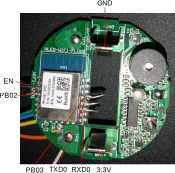
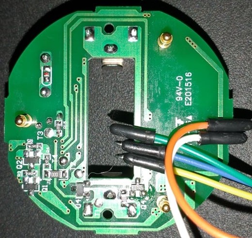
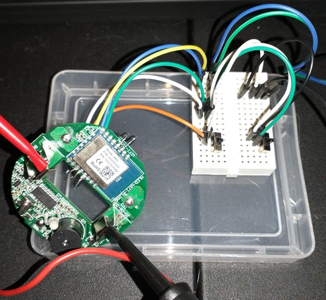
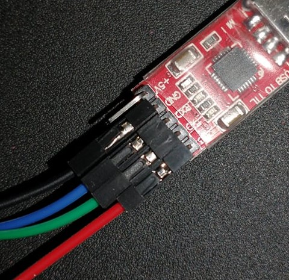

# XR3/XR809 MQTT + Tuya MCU Serial Communication Demo

Custom firmware for Feit Electric Smart Wi-Fi Water Sensor with MQTT and Tuya MCU Serial Communication. This device has the Tuya XR3 WIFI Module and a Tuya MCU.

This is an attempt at a custom firmware for the Feit Electric Smart Wi-Fi Water Sensor (https://www.feit.com/product/smart-wi-fi-water-sensor/) which has a Tuya XR3 WIFI Module (https://developer.tuya.com/en/docs/iot/xr3-datasheet?id=K98s9168qi49g) following the efforts of p.kaczmarek2 on elektroda.com (https://www.elektroda.com/rtvforum/topic3806769.html#19447386). I got mine from my local Menards after seeing the elektroda post because it seemed like a fun project (https://www.menards.com/main/plumbing/pumps-tanks/pump-well-tank-accessories/feit-electric-smart-wi-fi-water-sensor/senfwag/p-7919224473280192-c-8672.htm).

FCC: https://fccid.io/SYW-H20WIFI
FCC Internal Pics: https://fccid.io/SYW-H20WIFI/Internal-Photos/Internal-Photos-4963163 

On boot, the firmware establishes a wifi connection, connects to MQTT, and sends a few home assistant MQTT-discovery payload. Using serial communication between the wifi module and the Tuya MCU, appropriate MQTT messages are sent to indicate sensor and battery state. The MCU automatically powers the XR3 down after a serial comm tells the MCU that the payloads were delivered.

All the relevant code is in /project/at_demo/main.c 

Although this is a functional demo, it's just that, a demo.

# Notes

## Setup

For compiler and hardware setup, I pretty much followed https://www.elektroda.com/rtvforum/topic3806769.html#19447386 exactly.

For booting to flash use the battery connectors for GND and 3.3V from UART, TXD0 to UART TX, RXD0 to UART RXD0, EN to GND, PB02 to GND, PB03 to GND. After plugging in the UART take EN off GND.

For normal booting, remove the PB02, PB03, and EN bridges to GND. You can have either PB02 or PB03 pulled down and boot normally, but if both are pulled down it won't. You can plug in the UART with EN pulled down then remove the bridge and it will boot normally. This is useful for getting your serial reading started before the chip boots. You can use the EN pin to switch between modes without unplugging the UART, hence the slide switch setup I show in the images below.

TXD0 and RXD0 are actually switched compared to normal convention in Tuya's pinout diagram (so the pin marked TXD0 goes to TX of your UART, the pin marked RXD0 goes to the RX of your UART). On the Tuya XR3 doc page, they say:

- RXD0 - Can be used as a debugging serial interface pin, connect with UART-RX
- TXD0 - Can be used as a debugging serial interface pin, connect with UART-TX
- RXD1 - User UART_RX, connect with UART-TX
- TXD1 - User UART_TX, connect with UART-RX

So, the RXD1 and TXD1 follow the usual convention, but the RXD0 and TXD0 are backwards. 

Pins were very easy to solder onto by bending over some jumpers to act as clips that hold themselves in place then applying solder. Powering the power with 3.3V from the USB UART. I put some slide switches on a small breadboard to be able to switch in and out of bootloader mode and use the reset pin easily.

### Pictures






### Relevant Tuya Docs

Water Detector Status Possibilities: https://developer.tuya.com/en/docs/iot/s?id=K9gf48ml3r38c

WIFI Low Power Device: https://developer.tuya.com/en/docs/iot/wifi-module-mcu-development-overview?id=K9eor8kzjbrrn

WIFI Low Power Device Serial Protocol: https://developer.tuya.com/en/docs/iot/tuyacloudlowpoweruniversalserialaccessprotocol?id=K95afs9h4tjjh

## Secrets

To use, you need to make a secrets.h file in /project/at_demo/ folder with content

```C
#define my_wifi_ssid "YourWifiSSID"
#define my_wifi_pass "YourWifiPassword"

#define my_mqtt_ip "xxx.xxx.x.xxx"
#define my_mqtt_port 1883
#define my_mqtt_user "yourmqttuser"
#define my_mqtt_pass "yourmqttpass"
```

## Module Timeout / Connection Procedure

In standard operation, the board gets powered on when moisture is detected, sends a message to the Tuya servers then app, then powers itself down (see the Tuya docs on low power wifi devices). The power on/power off process is controlled by the MCU, but the WIFI module has some control via serial communication.

Fortunately for flashing and testing, pressing the on-board button 3 times seems to put it in an "always on" mode. Otherwise, pressing and holding the on-board button restarts the device and keeps it on for 60s.
## WIFI Double Connect

For some reason, the wifi connection to my router always drops on first connect. So, I simply call the connection code twice with a delay between rather than continuing on to considering it failed and launching an access point.

## MQTT Demo / It's actually a functional local sensor.

The XR809 SDK already had the paho embedded mqtt source included. So, it was just a matter of putting a demo together. The only real issue I encountered was that I could not make the buffer size too big or things broke, it's a bit my above my current knowledge base to figure out why.

I went ahead and went 1 step beyond a basic MQTT demo and send a Home Assistant MQTT discovery packet for a binary sensor. It's nearing the limit of the buffer size I was able to successfully test.

## Serial Comm

I'm referencing the Tuya docs a lot and some of the Tasmota source for getting serial communication between the wifi module (the XR3) and the Tuya MCU. The SDK had the serial code, and it was honestly very simple to get setup after a bit of digging. Right now, I'm sending a signal to the MCU that the WIFI Module is on and connected to the wifi network and cloud. That signal basically tell the MCU "hey I'm here and on, and if you have states to send to the cloud, I can do that now." That prompts an acknowledgment message from the MCU then the state package. From parsing the state packages, I'm sending appropriate MQTT payloads then telling the MCU that I'm done sending things and it powers down the WIFI module.

# Open Questions/Thoughts

- What's the deal with the buffer size limit? <-- I think this has to do with the stack size allocated to the main loop, but when I've tried to increase it in the project config file, the module seems to just not boot at all.

- I tried disabling both the web server and at_cmd code and the whole thing just seemed to break/stop working. Not sure what that's about.

- I probably should have started with a different device using this module that's not as specialized a use case. Would love to see what other devices have the XR3, but my local Menards had this device. I know the common answer will probably be to just do a chip swap, but at this point, my smart home is setup and I'm just doing these as hobby projects so the fun is in the chase.